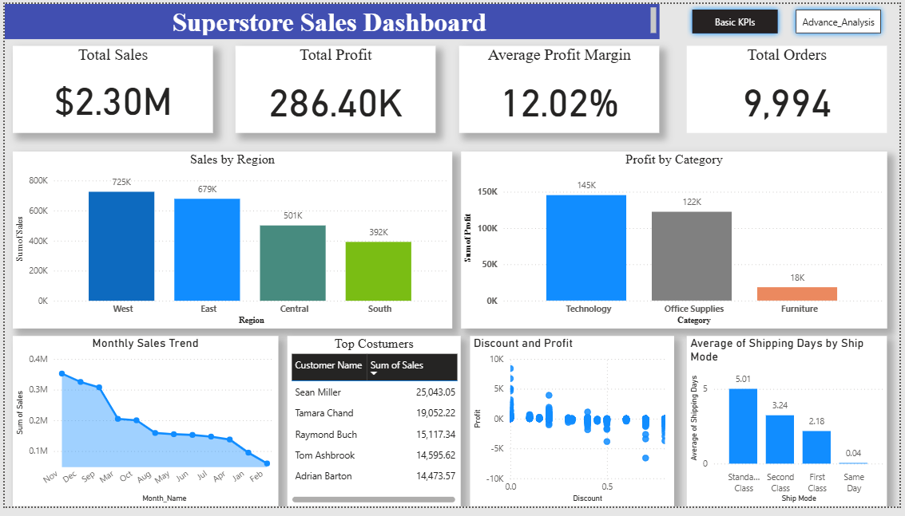
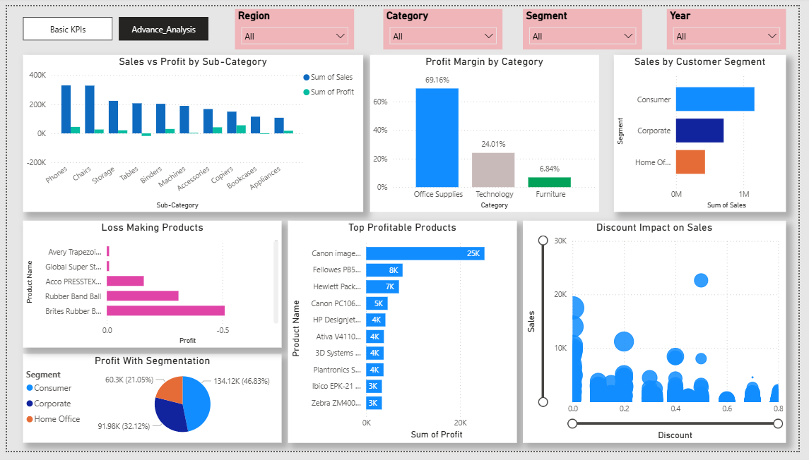

# Superstore Sales Analytics Dashboard

## Project Overview

This project analyzes retail sales data from a Superstore dataset to uncover insights related to sales performance, profitability, customer segments, and shipping efficiency.

The project demonstrates a complete **data analytics workflow**, including **data cleaning using Python, data observation in Excel, and dashboard creation using Power BI**.

The final result is an interactive **two-page Power BI dashboard** that provides both **high-level KPIs and advanced business insights**.

---

# Dashboard Preview

## Basic KPI Dashboard

## Advanced Business Insights

---

# Tools & Technologies Used

| Tool            | Purpose                                   |
| --------------- | ----------------------------------------- |
| Python (Pandas) | Data cleaning and preprocessing           |
| Excel           | Initial data observation and verification |
| Power BI        | Interactive dashboard creation            |
| GitHub          | Project hosting and version control       |

---

# Data Preparation Process

## 1. Data Collection

The dataset used in this project is the **Superstore Sales dataset**, which contains information about:

* Orders
* Customers
* Products
* Shipping
* Sales
* Profit
* Discounts

---

## 2. Data Observation in Excel

Before cleaning the data programmatically, the dataset was first examined in Excel to:

* Understand column structure
* Check for duplicates
* Observe missing values
* Identify possible inconsistencies

This step helped in planning the **data cleaning strategy**.

---

## 3. Data Cleaning Using Python

Data cleaning was performed using **Pandas** in Python.

### Key Steps Performed

* Removed unnecessary columns
* Converted date columns to proper datetime format
* Removed duplicate records
* Verified data types for numeric columns
* Created additional analytical columns

### Feature Engineering

New columns were created to improve analysis:

* **Profit Margin**
  Profit / Sales

* **Order Year**

* **Order Month**

* **Shipping Days**
  Difference between Order Date and Ship Date

These features helped perform deeper business analysis.

---

# Dashboard Structure

The Power BI dashboard contains **two pages**.

---

# Page 1 – Sales Overview

This page provides high-level business metrics.

### KPIs

* Total Sales
* Total Profit
* Average Profit Margin
* Total Orders

### Visualizations

* **Sales by Region**
  Identifies which geographic region generates the most revenue.

* **Profit by Category**
  Shows profitability of Technology, Furniture, and Office Supplies.

* **Monthly Sales Trend**
  Displays sales fluctuations across months.

* **Top Customers**
  Identifies high-value customers based on total purchases.

* **Discount vs Profit Scatter Plot**
  Analyzes the relationship between discounts and profitability.

* **Shipping Performance**
  Shows average shipping days for each shipping mode.

---

# Page 2 – Advanced Business Insights

This page focuses on deeper analysis and business decision support.

### Visualizations

**Sales vs Profit by Sub-Category**

Helps identify products with high sales but low profitability.

---

**Profit Margin by Category**

Shows which product categories generate the highest margin.

---

**Sales by Customer Segment**

Compares revenue generated by:

* Consumer
* Corporate
* Home Office

---

**Loss Making Products**

Highlights products that generate negative profit.

---

**Top Profitable Products**

Identifies products contributing the most profit.

---

**Discount Impact on Sales**

Scatter plot showing how discounts influence sales volume.

---

**Profit by Customer Segment**

Shows which segment contributes most to profitability.

---

# Key Business Insights

### 1. Consumer Segment Generates the Highest Sales

The Consumer segment contributes the largest portion of total revenue.

---

### 2. Technology Category Produces the Highest Profit

Technology products generate significantly higher profits compared to other categories.

---

### 3. Furniture Category Has Low Profitability

Despite generating sales, the Furniture category contributes relatively low profit.

---

### 4. High Discounts Often Reduce Profit

The scatter analysis indicates that higher discounts frequently lead to lower profits.

---

### 5. Some Products Consistently Generate Losses

Certain products in the Furniture category are repeatedly sold at a loss.

---

### 6. Standard Class Shipping Is the Most Used but Slowest

Standard Class shipping is the most frequently used delivery mode but has the longest delivery time.

---

# Challenges Faced During the Project

### Data Understanding

Understanding the dataset structure and relationships between columns required careful exploration.

---

### Data Cleaning

Some columns required cleaning and transformation before analysis.

Examples include:

* Converting **Order Date** and **Ship Date** into datetime format
* Removing duplicate records
* Verifying numerical fields

---

### Feature Engineering

Additional columns such as **Profit Margin** and **Shipping Days** had to be created to perform deeper analysis.

---

### Date Formatting

Handling date formats correctly was necessary to create time-based visualizations such as monthly trends.

---

### Dashboard Design

Designing a clean and informative dashboard layout required careful arrangement of visuals and consistent formatting.

---

# Project Outcome

This project successfully demonstrates:

* Data cleaning using Python
* Exploratory analysis using Excel
* Interactive dashboard creation using Power BI
* Business insight generation from retail sales data

The final dashboard allows users to explore:

* Sales performance
* Product profitability
* Customer behavior
* Discount effects
* Shipping efficiency

---

# Future Improvements

Possible improvements include:

* Adding geographic sales maps
* Implementing customer lifetime value analysis
* Forecasting future sales trends

---

# Author

**Rahul Singh**

Aspiring Data Analyst with a background in Bioinformatics and strong interest in data analytics, visualization, and machine learning.

LinkedIn:
https://www.linkedin.com/in/rahul-kumar-singh-1796b5332/

Portfolio:
http://codebyrahul.in
